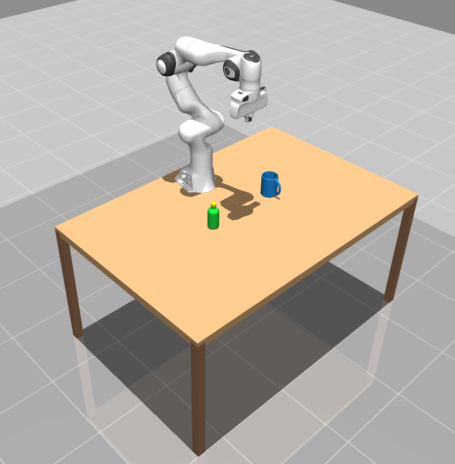
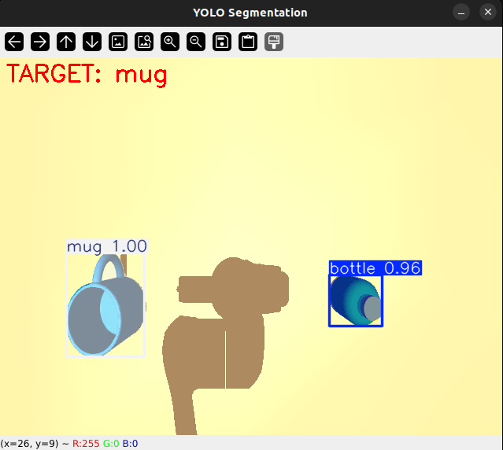
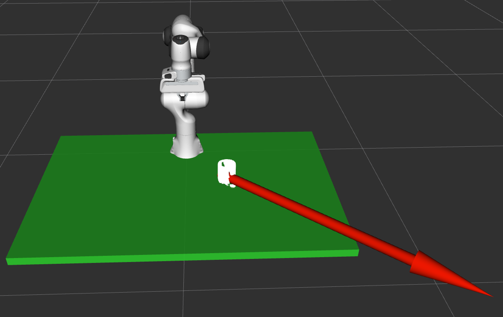
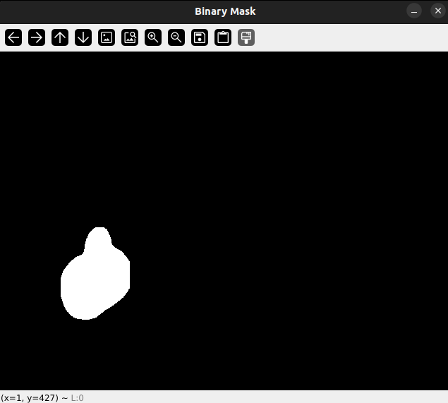
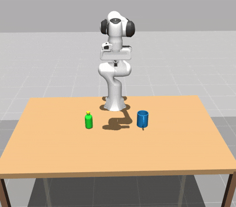

# **Franka Emika Panda MuJoCo RGB-D Grasp Detection**

## 📝 **Project Description**

Developed by Pedro Crisp, Enzo Kozonoe, and Murilo Gebra at the Chair of Cyber-Physical Systems, Montanuniversität Leoben, this project implements a modular MuJoCo simulation framework integrated with ROS 2 for robotic manipulation and grasp detection.

### **Problem Statement**

The project addresses three key technical requirements for a robotic perception pipeline:

1. **Simulation Setup**: Model the Franka Emika Panda robot with a wrist-mounted RGB-D camera in a tabletop scenario using a high-fidelity simulator.

2. **Object Segmentation**: Integrate object segmentation with YOLO to segment color images pixel-wise.

3. **Grasp Synthesis**: Integrate grasp pose detection (GPD or Dex-Net) and combine it with pixel-wise segmentation to derive 3D grasp poses for specific object segments.

### **Proposed Solution**

We engineered a ROS 2 node architecture that processes data in stages:

- **Data Generation**: MuJoCo simulates the robot and sensors. A custom wrapper linearizes OpenGL depth buffers into metric depth maps and generates synchronized point clouds.

- **Semantic Segmentation**: YOLOv8 processes the RGB stream in real-time, outputting binary masks that isolate objects from the background.

- **Targeted Grasping**: A filtering mechanism maps 2D YOLO masks to 3D point cloud indices. Isolated clusters are fed into GPD to sample and rank valid 6-DOF grasp candidates.

- **Motion Planning**: MoveIt 2 calculates collision-free trajectories for the selected grasp poses, executing kinematic solutions on the simulated robot via a ROS 2 control interface.

## 🎯 **Key Features**

- **Real-time Physics**: High-fidelity simulation using MuJoCo for accurate contact dynamics and gravity compensation.

- **Computer Vision Pipeline**: Simulates an RGB-D camera attached to the end-effector and integrates YOLOv8 for real-time object segmentation.

- **Synthetic Data Generation**: Tools to automatically generate labeled datasets for training vision models.

- **ROS 2 & MoveIt Integration**: The simulation synchronizes with MoveIt 2 for motion planning and obstacle avoidance.

## 🧪 **Example Results**

Below is a demonstration of the complete perception-to-action pipeline.

### 1. Simulation Environment

The simulation consists of a robotic manipulator operating over a table with objects in the workspace, used to test perception, grasp generation, and execution in a controlled scenario.

<p align="center">
    
</p>

### 2. Real-time Object Segmentation

The wrist-mounted RGB camera feed is processed by YOLOv8, which detects the target object and produces a segmentation result.

<p align="center">
    
</p>

### 3. RViz Visualization

In RViz, grasp-related data can be visualized to understand the perception and planning pipeline:

- Click **Add** → **By topic** → **PointCloud2**
- Select the topic: `/grasp/debug_cloud`
- Click **Add** → **By topic** → **Pose**
- Select the topic: `/grasp_pose`

This displays the processed point cloud and estimated grasp pose in the scene.

<p align="center">
    
</p>

### 4. Binary Mask Output

The system generates a binary mask representing the segmented object of interest, used during grasp detection.

<p align="center">
    
</p>

### 5. Grasp Execution

The GIF below shows the pre-grasp motion of the robotic gripper, including approach, alignment, and finger opening before contact.

<p align="center">
    
</p>

## ⚙️ **System Prerequisites**

Before starting, ensure the following are installed and configured:

- **Operating System**: Ubuntu 22.04 LTS (recommended for ROS 2 Humble)
- **ROS 2 Humble**: Follow the [official installation guide](https://docs.ros.org/en/humble/Installation.html)
- **GPD Dependencies**: See the [Official GPD Installation Guide](https://github.com/atenpas/gpd?tab=readme-ov-file#install)

### Required Packages

Run the following commands to install system dependencies:

1. **MoveIt 2** (motion planning framework):

   ```bash
        sudo apt install ros-humble-moveit
   ```

2. **Panda Configuration Package** (Franka Emika Panda resources):

   ```bash
        sudo apt install ros-humble-moveit-resources-panda-moveit-config
   ```

3. **Gnome Terminal** (required for multi-tab launch script):

   ```bash
        sudo apt install gnome-terminal
   ```

## 🚀 **Project Installation**

### 1. System Dependencies (APT)

Install ROS 2 packages, MoveIt, and hardware controllers:

```bash
sudo apt update
sudo apt install -y \
        ros-humble-desktop \
        ros-humble-moveit \
        ros-humble-moveit-resources-panda-moveit-config \
        ros-humble-ros2-control \
        ros-humble-ros2-controllers \
        ros-humble-controller-manager \
        ros-humble-cv-bridge \
        ros-humble-vision-opencv \
        ros-humble-message-filters \
        ros-humble-tf2-ros \
        ros-humble-tf-transformations \
        libpcl-dev \
        libeigen3-dev \
        python3-numpy \
        python3-venv
```

### 2. Python Dependencies

**⚠️ Important Note for Virtual Environments:**

This project relies on `rclpy` (ROS 2 Python client), a system package that cannot be installed via pip. If using a virtual environment, create it with the `--system-site-packages` flag:

```bash
python3 -m venv venv --system-site-packages
```

If not using a venv, run: `pip install -r requirements.txt`

### 3. Configuration Changes

Before running the project, update GPD configuration files. See the README in the `config_changes` folder.

### 4. Recommended Setup

Add ROS 2 sourcing to your `.bashrc` to avoid repeating it each session:

```bash
echo source /opt/ros/humble/setup.bash >> ~/.bashrc
```

If your keyboard layout is not English, also add:

```bash
echo export LD_LIBRARY_PATH=$MJ_HOME/lib:$LD_LIBRARY_PATH >> ~/.bashrc
echo export LC_NUMERIC="en_US.UTF-8" >> ~/.bashrc
```

## ▶️ **How to Run**

The project includes an automated script that starts all necessary nodes.

1. **Grant execution permission**:

    ```bash
    chmod +x run_all.sh
    ```

2. **Setup Environment & Run**:

   Load the ROS 2 environment (and your venv, if active) before running the script:

   ```bash
        # Load ROS 2 Humble
        source /opt/ros/humble/setup.bash
        
        # Activate your venv (if created)
        # source venv/bin/activate
        
        # Run the system
        ./run_all.sh
   ```

This opens several terminal tabs for Simulation, MoveIt, YOLO Vision, and Control nodes.

## 🔧 **Common Troubleshooting**

- **`ModuleNotFoundError: No module named 'rclpy'`**: Recreate your venv with `--system-site-packages` flag.

- **`ros2: command not found`**: Run `source /opt/ros/humble/setup.bash` before starting.

- **RViz doesn't show the robot**: If your keyboard layout is not English, set your locale in `.bashrc`:
  ```bash
        export LD_LIBRARY_PATH=$MJ_HOME/lib:$LD_LIBRARY_PATH
        export LC_NUMERIC="en_US.UTF-8"
  ```

## 🆕 **How to Add and Train New Objects**

To manipulate a new object, add it to the simulation and retrain YOLO to recognize it.

### **Add the Object to Simulation (MuJoCo)**

1. **Prepare the Mesh**:
- Obtain the 3D file (`.stl` or `.obj` format)
- Place it in the `model/objects/` folder

2. **Edit the Scene XML** (`model/scene.xml`):
- Register the mesh in the `<asset>` section
- Add the object body to `<worldbody>`

   ```xml
        <asset>
                <mesh name="my_new_object_mesh" file="assets/my_object.stl" scale="0.001 0.001 0.001"/>
        </asset>

        <worldbody>
                <body name="my_new_object" pos="0.5 0.0 0.05">
                        <freejoint/>
                        <geom type="mesh" mesh="my_new_object_mesh" mass="0.1" rgba="1 1 0 1"/>
                </body>
        </worldbody>
   ```

3. **Verify**: Run the simulation and ensure the object appears on the table:

   ```bash
        python3 nodes/simulation_node.py
   ```

### **Data Collection & Labeling**

1. **Automated Data Collection**:
- Run the simulation in one terminal
- In another terminal, run the collector script:

   ```bash
        python3 training/auto_collector.py
   ```

- The robot moves the camera to various viewpoints and saves images to `dataset_v2/images`
- When the script pauses, manually move/rotate objects in the MuJoCo window, then press ENTER to continue

2. **Annotation** (using Roboflow):
- Create a Roboflow account at [app.roboflow.com](https://app.roboflow.com/login)
- Create a new Instance Segmentation project
- Upload images from `dataset_v2/images`
- Annotate using the Smart Polygon tool to automatically generate masks for your object
- Assign the class name (e.g., "banana")
- Export the dataset in YOLOv8 format and download the `.zip` file

### **Training & Integration**

1. **Prepare Workspace**:
- Extract the downloaded `.zip` into `training/dataset`
- Verify that `data.yaml` points to the correct image paths

2. **Train the Model**:
- Update `training/train_yolo.py` with the path to your new `data.yaml`
- Run the training script:

   ```bash
        python3 training/train_yolo.py
   ```

- Weights are saved at `runs/segment/YOUR_RUN_NAME/weights/best.pt`

3. **Update the Robot Code**:
   - Copy `best.pt` to the `training/` folder
    - Update the Segmentation Node (`nodes/object_segmentation_node.py`):

   ```python
        self.model = YOLO("training/best.pt")
   ```

   - Update the Commander Node (`nodes/commander_node.py`) to add your new object:

     ```python
        print("4. New Object")
        # ... inside the loop ...
        elif choice == '4':
                node.set_target("new_object")  # Must match the Roboflow class name
     ```

